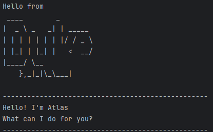
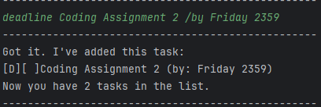
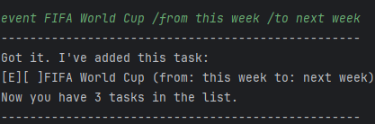
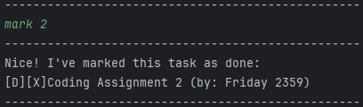
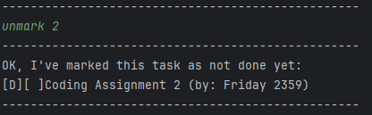
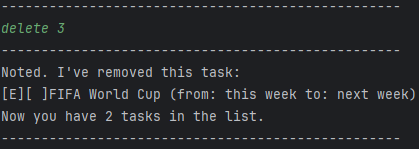
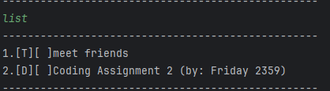
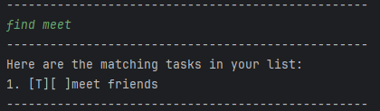
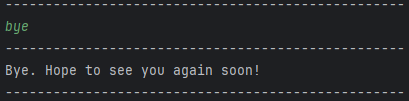

# User Guide

Atlas is an app for managing and scheduling your tasks

## Features

**Add Tasks:** You are able to add tasks such as todos, deadlines and events.

**Delete Tasks:** You are able to remove tasks from the list once they are no longer needed.

**Mark Tasks:** You are able to check the tasks that have been completed

**Unmark Tasks:** You are able to uncheck the tasks that are not yet complete

**Find Tasks:** You are able to search for tasks using specific keywords

**List Tasks:** You are able to view all the tasks that you currently have

## Usage

### `todo` - Add a Todo task
Adds a todo task into a list of tasks

Format: `todo TASK`

- The command `todo` is case-sensitive
- The task to be added `TASK` can be of any format (letters, numbers or symbols)

Example of usage: `todo meet friends`

Expected outcome:

### `deadline` - Add a Deadline task
Adds a deadline task into a list of tasks and also indicates the due date

Format: `deadline TASK /by DATE`

- The command `deadline` is case-sensitive
- The command `/by` must be in this format and is case-sensitive
- The task to be added `DEADLINE` can be of any format (letters, numbers or symbols)
- The due date of the task `DATE` can be any format (letters, numbers or symbols)

Example of usage: `deadline Coding Assignment 2 /by Friday 2359`

Expected outcome:

### `event` - Add a Event task
Adds an event task into a list of tasks and also indicates the start date and end date

Format: `deadline EVENT /from DATE /to DATE`

- The command `deadline` is case-sensitive
- The commands `/from` and `/to` must be in this format and are case-sensitive
- The task to be added `DEADLINE` can be of any format (letters, numbers or symbols)
- The start and end dates of the task `DATE` can be any format (letters, numbers or symbols)

Example of usage: `event FIFA World Cup /from this week /to next week`

Expected outcome:

### `mark` - Marks a task as done
Marks a task in the list once it is completed

Format: `mark INDEX`

- The command `mark` is case-sensitive
- The input `INDEX` is the index of the task you want to mark in the list
- The index of the task to mark `INDEX` must be a positive integer and should be less than total number of tasks in list
- If `INDEX` is out of bounds, there will be an error message

Example of usage: `mark 2`

Expected outcome:

### `unmark` - Un-marks a task as incomplete
Unmark a task in the list if it is incomplete

Format: `unmark INDEX`

- The command `unmark` is case-sensitive
- The input `INDEX` is the index of the task you want to unmark in the list
- The index of the task to unmark `INDEX` must be a positive integer and should be less than total number of tasks in list
- If `INDEX` is out of bounds, there will be an error message

Example of usage: `unmark 2`

Expected outcome:

### `delete` - Deletes a task from the list of tasks
Deletes a task from the list of tasks once it is not needed

Format: `delete INDEX`

- The command `delete` is case-sensitive
- The input `INDEX` is the index of the task you want to delete in the list
- The index of the task to delete `INDEX` must be a positive integer and should be less than total number of tasks in list
- If `INDEX` is out of bounds, there will be an error message

Example of usage: `delete 3`

Expected outcome:

### `list` - Lists all the tasks in the list of tasks
Lists all the current tasks you have in the list, including its status (unmarked/marked and also the type of task)

Format: `list`

- The command `list` is case-sensitive

Example of usage: `list`

Expected outcome:

### `find` - Finds the tasks that have the specified keyword
Searches for the tasks in the list of tasks that has the specified keyword and lists them out

Format: `find KEYWORD`

- The command `find` is case-sensitive
- The keyword `KEYWORD` is case-sensitive
- The keyword `KEYWORD` can be of any format (letters, numbers and symbols)

Example of usage: `find meet`

Expected outcome:

### `bye` - Stops Atlas from running
Stops the program

Format: `bye`

- The command `bye` is case-sensitive

Example of usage:

`keyword (optional arguments)`

Expected outcome:

