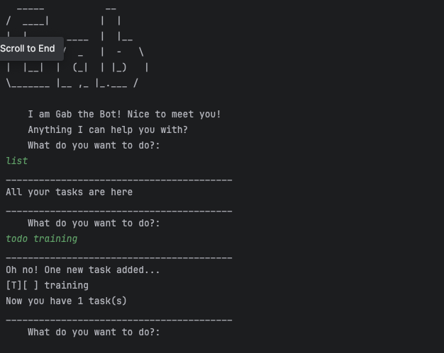

# GAB chatbot User Guide

Gab is a **Command Line Interface (CLI)** desktop app for managing your tasks (todo, deadline and event). 

* [Quick start](#quick-start)
* [Features](#features)
  * [Adding a new todo task: `todo`](#adding-a-new-todo-task-todo)
  * [Adding a new deadline task: `deadline`](#adding-a-new-deadline-task-deadline)
  * [Adding a new event task: `event`](#adding-a-new-event-task-event)
  * [Listing all tasks: `list`](#listing-all-tasks-list)
  * [Mark task as done: `mark`](#mark-task-as-done-mark)
  * [Mark task as not done: `unmark`](#mark-task-as-not-done-unmark)
  * [Find task that contains keyword: `find`](#find-task-that-contains-keyword-find)
  * [Delete task: `delete`](#delete-task-delete)
  * [Exit program: `bye`](#exit-program-bye)
* [FAQ](#faq)
* [Command summary](#command-summary)


## Quick start
1. Ensure you have Java `11` or above installed in your computer.
2. Download the latest `Gab.java` from [here](https://github.com/leongxingyu/ip/releases/tag/A-Jar).
3. Copy the file to the folder you want to use as the home folder for your chatbot.
4. Open a command terminal, `cd` into the folder you put the jar file in, and use `java -jar ip.jar` command to run the application. The terminal should display something similar to the image below.

5. Type the commands (`list`, `todo training`) and press `ENTER` to execute it.
6. Refer to the [Features](#features) below for implementations of each command.

## Features

> [!WARNING]
> Any commands executed **MUST STRICTLY** follow the format specified.
>
> Any deviation in the format will result in an error.

### Adding a new todo task: `todo`
Create a todo task with just the task name.

Format: `todo TASK_NAME`

Examples:
* todo training
* todo create jar file

Expected outcome: 
```
_________________________________________
Oh no! One new task added...
[T][ ] training
Now you have 1 task(s)
_________________________________________

```
### Adding a new deadline task: `deadline`
Create a deadline task with a name and deadline.

Format: `deadline TASK_NAME /by DEADLINE`

Examples:
* deadline training /by tmr
* deadline create jar file /by week 7

Expected outcome:
```
_________________________________________
Ok! Watch the deadline!
[D][ ] training (by: tmr)
Now you have 2 task(s)
_________________________________________

```

### Adding a new event task: `event`
Create a deadline task with a name, start and end date.

Format: `event TASK_NAME /from START_DATE /to END_DATE`

Examples:
* event training /from saturday 9am /to 11am
* event attend class /from now /to tmr

Expected outcome:
```
_________________________________________
Weehoo! Enjoy the event!
[E][ ] training (from: saturday 9am to: 11am)
Now you have 3 task(s)
_________________________________________

```

### Listing all tasks: `list`
List all the task in a numbered list from the task list.

Format: `list`

Examples:
* list

Expected outcome:
```
_________________________________________
All your tasks are here
1.[D][ ] training 
2.[D][ ] training (by: tmr)
3.[E][ ] training (from: saturday 9am to: 11am)
_________________________________________

```

### Mark task as done: `mark`
Mark task with a cross to show that it is done

Format: `mark TASK_INDEX`
* Mark task of the TASK_INDEX as done with a cross
* TASK_INDEX **must be positive integer** 1, 2, 3, ...

Examples:
* mark 1

Expected outcome:
```
_________________________________________
One done!
[T][X] training
_________________________________________

```

### Mark task as not done: `unmark`
Un-mark task to show that it is not done

Format: `unmark TASK_INDEX`
* Un-mark task of the TASK_INDEX 
* TASK_INDEX **must be positive integer** 1, 2, 3, ...

Examples:
* unmark 1

Expected outcome:
```
_________________________________________
Oh no!
[T][ ] training
_________________________________________

```

### Find task that contains keyword: `find`
Un-mark task to show that it is not done

Format: `find KEYWORD`
* KEYWORD is the word you want to find 
* KEYWORD is not case sensitive

Examples:
* find floorball
* find training

Expected outcome:
```
_________________________________________
Yay! No task found...
_________________________________________

```
```
_________________________________________
1. [T][ ] training
2. [D][ ] training (by: tmr)
3. [E][ ] training (from: saturday 9am to: 11am)
_________________________________________

```

### Delete task: `delete`
Delete task from task list

Format: `delete TASK_INDEX`
* Delete task of the TASK_INDEX
* TASK_INDEX **must be positive integer** 1, 2, 3, ...

Examples:
* delete 1

Expected outcome:
```
_________________________________________
Ok task deleted!
	[T][ ] training
Now you have 2 task(s)
_________________________________________

```

### Exit program: `bye`
Exits the program

Format: `bye`

Examples:
* bye

Expected outcome:
```
_________________________________________
All the best!
_________________________________________

```

## FAQ
**Q**: How do I transfer my data to another Computer?

**A**: Install the app in the other computer and overwrite the empty data file it creates with the file that contains the data.

## Command summary

| **Command**  |                   **Format**                   |                 **Examples**                  |
|:------------:|:----------------------------------------------:|:---------------------------------------------:|
|   **todo**   |                 todo TASK_NAME                 |        todo training, todo cs2113t ip         |
| **deadline** |        deadline TASK_NAME /by DEADLINE         |            deadline ip /by week 7             |
|  **event**   | event EVENT_NAME /from START_DATE /to END_DATE | event competition /from 21st May /to 22nd May |
|   **list**   |                      list                      |                     list                      |
|   **mark**   |                mark TASK_INDEX                 |                mark 1, mark 5                 |
|  **unmark**  |               unmark TASK_INDEX                |              unmark 1, unmark 5               |
|   **find**   |                  find KEYWORD                  |         find floorball, find training         |
|  **delete**  |               delete TASK_INDEX                |              delete 1, delete 2               |
|   **bye**    |                      bye                       |                      bye                      |