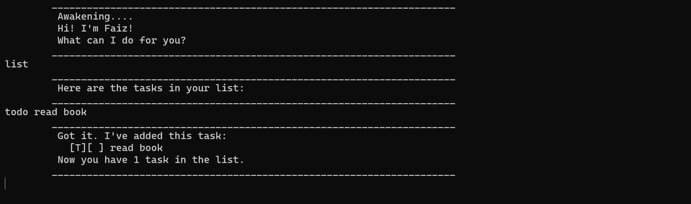

# FaizBot User Guide

FaizBot is a desktop chatbot for managing your task list, optimised for use via a Command Line Interface (CLI). 

* [Quick Start](#quick-start)
* [Features](#features)
  - [Adding a todo task: `todo`](#adding-a-todo-task-todo)
  - [Adding a deadline task: `deadline`](#adding-a-deadline-task-deadline)
  - [Adding an event task: `event`](#adding-an-event-task-event)
  - [Listing all tasks: `list`](#listing-all-tasks-list)
  - [Marking task as complete: `mark`](#marking-task-as-complete-mark)
  - [Marking task as incomplete: `unmark`](#marking-task-as-incomplete-unmark)
  - [Finding tasks by keyword: `find`](#finding-tasks-by-keyword-find)
  - [Deleting a task: `delete`](#deleting-a-task-delete)
  - [Exiting the chatbot: `bye`](#exiting-the-chatbot-bye)
  - [Saving the data](#saving-the-data)
* [FAQ](#faq)

------------------------------------------------------------------------------------------------------------------------

## Quick Start

1. Ensure you have Java `11` or above installed in your computer.

2. Download the latest `FaizBot.jar` from [here](https://github.com/NgYaoDong/ip/releases).

3. Copy the file to the folder you want to use as the _home folder_ for your chatbot.

4. Open a command terminal, `cd` into the folder your put the jar file in, and use the `java -jar FaizBot.jar` command to run the application.
   The terminal should display something similar to the image below.
   

5. Type the command in the command box and press Enter to execute it. <br> e.g. typing `list` and pressing Enter will list all tasks in the task list.

6. Refer to the [Features](#features) below for details of each command.

------------------------------------------------------------------------------------------------------------------------

## Features
> <strong> Notes about the command format: </strong>
> * Words in `UPPER_CASE` are the parameters to be supplied by the user. <br>
> e.g. in `todo TASK`, `TASK` is a parameter which can be used as `todo return book`.
>
> 
> * Extraneous parameters for commands that do not take in parameters (such as `list` and `bye`) will be ignored. <br>
> e.g. if the command specifies `list 123`, it will be interpreted as `list`.

### Adding a todo task: `todo`

Adds a todo task that are tasks with neither a specific deadline nor a start/end date.

Format: `todo TASK`

Examples:
* `todo complete quiz`
* `todo do taxes`

Expected outcome:

FaizBot will display a message similar to the following upon successful addition of the todo task.

```
Got it. I've added this task:
     [T][ ] complete quiz
Now you have 1 task in the list.
```

### Adding a deadline task: `deadline`

Adds a deadline task that are tasks with a specific deadline.

Format: `deadline TASK /by YYYYMMDD HHMM`
>  <strong>Tip: </strong> If the time `HHMM` is not given, it will be autofilled as 2359 hrs.

Examples:
* `deadline watch lecture /by 2024-02-14 1800` Creates a deadline task with the description of `watch lecture` and the deadline by `2024-02-14 1800`.
* `deadline pay bills /by 2024-02-29`

Expected outcome:

FaizBot will display a message similar to the following upon successful addition of the deadline task.

```
Got it. I've added this task:
     [D][ ] watch lecture (by: Feb 14 2024 1800)
Now you have 2 tasks in the list.
```

### Adding an event task: `event`

Adds an event task that are tasks with a start and end date/time.

Format: `event TASK /from YYYYMMDD HHMM /to YYYYMMDD HHMM`
>  <strong>Tip: </strong> If the start/end time `HHMM` is not given, it will be autofilled as 0000 hrs for start and 2359 hrs for end.

Examples:
* `event meet friends /from 2024-11-11 1200 /to 2024-11-11 2300` Creates an event task with the description of `meet friends`, the start date/time as `2024-11-11 1200` and the end date/time as `2024-11-11 2300`.
* `event cruise trip /from 2024-12-01 /to 2025-01-01`

Expected outcome:

FaizBot will display a message similar to the following upon successful addition of the deadline task.

```
Got it. I've added this task:
     [E][ ] meet friends (from: Nov 11 2024 1200 to: Nov 11 2024 2300)
Now you have 3 tasks in the list.
```

### Listing all tasks: `list`

Displays all tasks in the task list on the screen.

Format: `list`

Expected outcome:

FaizBot will display a message similar to the following upon input of the `list` command.

```
Here are the tasks in your list:
1.[T][ ] complete quiz
2.[D][ ] watch lecture (by: Feb 14 2024 1800)
3.[E][ ] meet friends (from: Nov 11 2024 1200 to: Nov 11 2024 2300)
```

### Marking task as complete: `mark`

Marks the specified task in the task list as complete.

Format: `mark INDEX`

* Marks the task at the specified `INDEX`.
* The index refers to the index number shown in the displayed task list.
* The index must be a **positive integer** 1, 2, 3, ...

Expected outcome:

FaizBot will display a message similar to the following upon input of the `mark 2` command.

```
Nice! I've marked this task as done:
     [D][X] watch lecture (by: Feb 14 2024 1800)
```

### Marking task as incomplete: `unmark`

Marks the specified task in the task list as incomplete.

Format: `unmark INDEX`

* Marks the task at the specified `INDEX`.
* The index refers to the index number shown in the displayed task list.
* The index must be a **positive integer** 1, 2, 3, ...

Expected outcome:

FaizBot will display a message similar to the following upon input of the `unmark 2` command.

```
OK, I've marked this task as not done yet:
     [D][ ] watch lecture (by: Feb 14 2024 1800)
```

### Finding tasks by keyword: `find`

Finds all tasks in the task list containing the keyword.

Format: `find KEYWORD`

* The search is case-sensitive. e.g. `BOOK` will not match `book`
* The order of the keywords does matter. e.g. `read book` will not match `book read`
* Only the description is searched.

Expected outcome:

FaizBot will display a message similar to the following upon input of the `find friend` command.

```
Here are the matching tasks in your list:
1.[E][ ] meet friends (from: Nov 11 2024 1200 to: Nov 11 2024 2300)
```

### Deleting a task: `delete`

Deletes the specified task from the task list.

Format: `delete INDEX`

* Marks the task at the specified `INDEX`.
* The index refers to the index number shown in the displayed task list.
* The index must be a **positive integer** 1, 2, 3, ...

Expected outcome:

FaizBot will display a message similar to the following upon input of the `delete 1` command.

```
Noted. I've removed this task:
     [T][ ] complete quiz
Now you have 2 tasks in the list.
```

### Exiting the chatbot: `bye`

Exits the chatbot.

Format: `bye`

Expected outcome:

FaizBot will display the following message upon input of the `bye` command.

```
Deformation....
Bye! Hope to see you again soon!
```

### Saving the data

FaizBot data are saved in the hard disk automatically after any command that changes the data. <br>
There is no need to save manually.

--------------------------------------------------------------------------------------------------

## FAQ

**Q**: How do I transfer my data to another computer? <br>
**A**: Install the app in the other computer and overwrite the empty data file it creates with the file that contains the data of your previous AddressBook home folder.