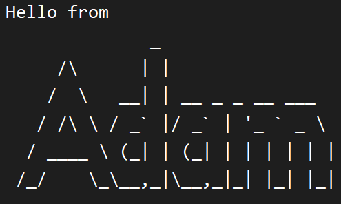

# Floda User Guide

Floda is a command-line to-do list application designed to help you manage your tasks efficiently. It allows you to add, delete, mark as done, and list tasks with ease.
## Quick Start

Prerequisites: JDK 11, Intellij.

1. Ensure you have Java installed on your computer.
2. Download the latest Floda.jar file from [here](https://github.com/shawnpong/ip/releases).
3. Place the downloaded file in your desired directory.
4. Open up a command prompt and navigate to the directory Floda.jar is in.
   - You can do so on windows by typing 'cmd' in the file explorer address bar. 
5. Run the application using the command 'java -jar Floda.jar'.
6. A CLI similar to the below should appear.

## Features
### Adding a Todo: `todo`

Add a task with description to your to-do list

Format: `todo <description>`

Replace `<description>` with a brief description of your task.

Example Input: `todo Buy Groceries`

Example Output: `Added: [T] [ ] Buy groceries`

### Adding a Deadline: `deadline`

Add a task with description and a deadline to your to-do list

Format: `deadline <description> /by <deadline>`

Replace `<description>` with a brief description of your task and `<deadline>` with the due date/time.

Example Input: `deadline Submit report /by 2024-03-10`

Example Output: `Added: [D] [ ] Submit report (by: 2024-03-10)`

###  Adding a Event: `event`

Add a task with description and a start and end time to your to-do list

Format: `event <description> /from <start time> /to <end time>`

Replace `<description>` with a brief description of your task, `<start time>` with the event start time, and `<end time>` with the event end time.

Example Input: `event Team meeting /from 2024-03-08 14:00 /to 2024-03-08 16:00`

Example Output: `Added: [E] [ ] Team meeting (from: 2024-03-08 14:00 to: 2024-03-08 16:00)`

###  Listing Tasks: `list`

To view all tasks in your to-do list so far

Format: `list`

Example Output: `<task number> [<task type>] [<task status>] <task description> (additional details)`
1. [T] [ ] Buy groceries
2. [D] [ ] Submit report (by: 2024-03-10)
3. [E] [ ] Team meeting (from: 2024-03-08 14:00 to: 2024-03-08 16:00)

###  Deleting a Task: `delete`

To delete a specific task in your todo list

Format: `delete <task number>`

Replace `<task number>` with the number corresponding to the task you want to delete.
> Tip: Use the command `list` to find the `<task number>` of the task you wish you delete

###  Marking a Task as Done: `mark`

Mark a specific task as done in your to-do list

Format: `mark <task number>`

Replace `<task number>` with the number corresponding to the task you want to mark as done.
> Tip: Use the command `list` to find the `<task number>` of the task you wish to mark as done.

Example Input: `mark 1`

Example Output: `I have marked this task as done: [T] [X] Buy Groceries`

###  Unmarking a Task: `unmark`

Remove the completion status of a specific task in your to-do list

Format: `unmark <task number>`

Replace `<task number>` with the number corresponding to the task you want to unmark.
> Tip: Use the command `list` to find the `<task number>` of the task you wish to unmark.

Example Input: `unmark 1`

Example Output: `I have marked this task as not done: [T] [ ] Buy Groceries`

###  Finding Tasks: `find`

Search for tasks containing a specific keyword in your to-do list

Format: `find <keyword>`

Replace `<keyword>` with the keyword you want to search for in your tasks.

Example Input: `find meeting`

Example Output: `Here are the matching tasks in your list:
1.[E] [ ] Team meeting (from: 2024-03-08 14:00 to: 2024-03-08 16:00)`

###  Exiting the Application: `bye`

Exits the Floda application

Format: `bye`

###  Saving tasks

Tasks are automatically saved to the tasks.txt file in the application directory after any command that modifies the task list.

###  Editing the Data File

You can directly edit the tasks.txt file to update tasks. Ensure the file format remains valid to avoid data loss.
>Caution: If your changes to the data file makes its format invalid, AddressBook will discard all data and start with an empty data file at the next run. Hence, it is recommended to take a backup of the file before editing it.

## Command Summary

| Command                                                 | Description                                                | Example Usage                  |
|---------------------------------------------------------|------------------------------------------------------------|--------------------------------|
| `todo <description>`                                    | Add a Todo task to the list with a description.           | `todo Buy Groceries`          |
| `deadline <description> /by <deadline>`                 | Add a Deadline task with a description and deadline. | `deadline Submit report /by 2024-03-10` |
| `event <description> /from <start time> /to <end time>` | Add an Event task with a description and time frame. | `event Team meeting /from 2024-03-08 14:00 /to 2024-03-08 16:00` |
| `list`                                                  | View all tasks in the to-do list.                         | `list`                         |
| `delete <task number>`                                  | Delete a specific task from the list.                     | `delete 1`                     |
| `mark <task number>`                                    | Mark a task as done.                                      | `mark 1`                       |
| `unmark <task number>`                                  | Remove the completion status of a task.                   | `unmark 1`                     |
| `find <keyword>`                                        | Search for tasks containing a specific keyword.           | `find meeting`                 |
| `bye`                                                   | Exit the application.                                     | `bye`                          |

